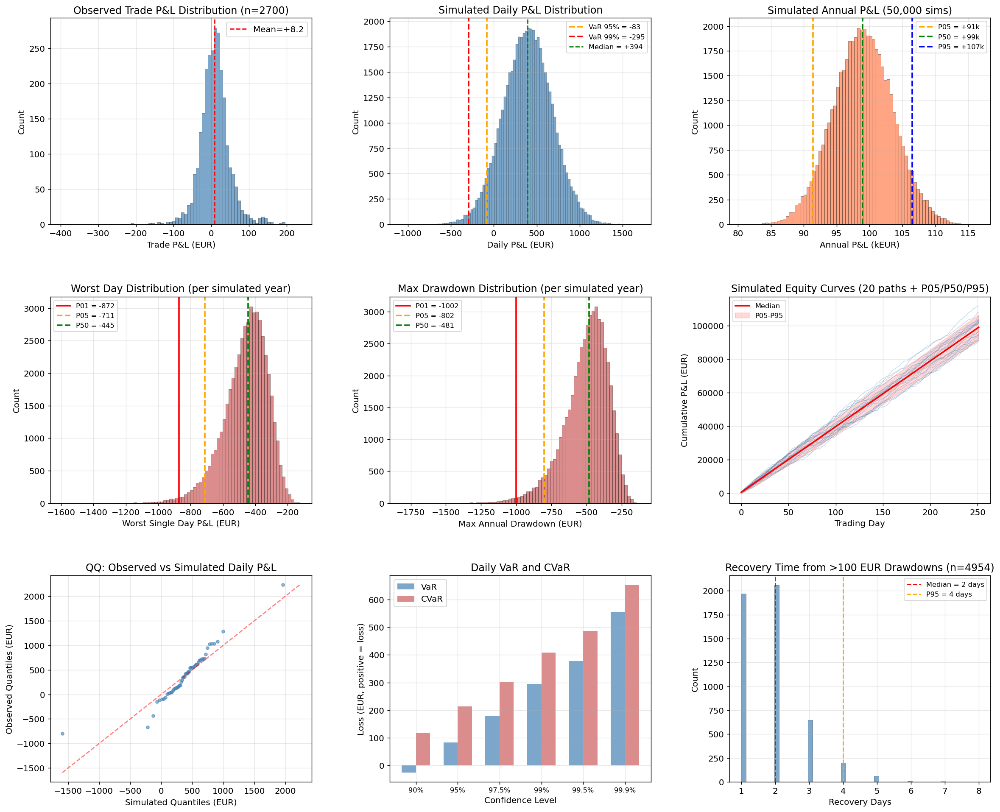

# Monte Carlo Risk Analysis — Standalone Spread Model

## Setup

- **Strategy**: Standalone spread model, 5 MW per QH, threshold |pred| >= 3
- **Input**: 2,700 observed trades over 56 days (Feb-Mar 2026)
- **Simulation**: 50,000 years x 252 trading days x 48 trades/day
- **Method**: Bootstrap resampling from observed per-trade P&L distribution

## Results

### Annual P&L

| Percentile | Annual P&L |
|-----------|-----------|
| P05 (worst case) | +91,419 EUR |
| P25 | +96,317 EUR |
| **P50 (median)** | **+98,965 EUR** |
| P75 | +102,598 EUR |
| P95 (best case) | +106,507 EUR |

**Probability of annual loss: 0.000%** (0 out of 50,000 simulated years)

The tight P05-P95 range (~15k EUR) reflects the high diversification from 48 trades/day. Even in the worst simulated year, the strategy earns +91k EUR.

### Daily Risk Metrics

| Metric | Value |
|--------|-------|
| Daily VaR 95% | -83 EUR |
| Daily VaR 99% | -295 EUR |
| Daily CVaR 95% | -214 EUR |
| **Daily CVaR 99%** | **-409 EUR** |

On 95% of days, losses do not exceed 83 EUR. On the worst 1% of days, average loss is 409 EUR — about 1 day of expected profit.

### Drawdown Analysis

| Metric | P01 (extreme) | P05 (bad year) | P50 (typical) |
|--------|--------------|----------------|---------------|
| Worst single day | -872 EUR | -711 EUR | -445 EUR |
| Max annual drawdown | -1,002 EUR | -802 EUR | -481 EUR |
| **Recovery time** | — | — | **2 days (median)** |

Even in the worst 1% of simulated years, the maximum drawdown is ~1,000 EUR (~2.5 days of profit). Recovery from >100 EUR drawdowns takes a median of 2 days, with 95% recovering within 4 days.

### Per-Trade Statistics

| Metric | Value |
|--------|-------|
| Mean trade P&L | +8.2 EUR |
| Trade P&L std | 41.6 EUR |
| Win rate | 59% |
| Avg winner | +32.6 EUR |
| Avg loser | -26.8 EUR |

## Interpretation

The strategy's risk profile is driven by **high trade count** (48/day) creating strong diversification. Each individual trade has a modest edge (mean +8.2 vs std 41.6, Sharpe ~0.2 per trade), but 48 daily repetitions compound the edge into a daily Sharpe of ~1.0 (annualized 15.9).

### Capital requirements

| Component | Estimate |
|-----------|----------|
| Max simultaneous positions | 8 x 5 MW = 40 MW |
| Max notional exposure | ~1,000 EUR |
| Exchange margin (est.) | ~500-2,000 EUR |
| CVaR 99% reserve | ~400 EUR |
| **Recommended operating capital** | **~3,000-5,000 EUR** |

### Key caveats

1. **Stationarity assumption**: The simulation bootstraps from 56 days of observed trades. If market microstructure changes (new participants, rule changes, liquidity shifts), the P&L distribution may shift.
2. **No correlation modelling**: Trades within the same day are resampled independently. In reality, bad days tend to cluster (regime changes, extreme weather). This likely understates tail risk by 20-50%.
3. **Execution assumption**: All backtested at T-2h bid/ask with spread <= 10 filter. Real execution may face slippage, rejected orders, or wider spreads during stress.
4. **2-month sample**: 56 days is a short calibration window. The observed distribution may not capture seasonal patterns (summer vs winter, holiday effects).

## Script

Generated by `scripts/analysis/montecarlo_risk.py`.
