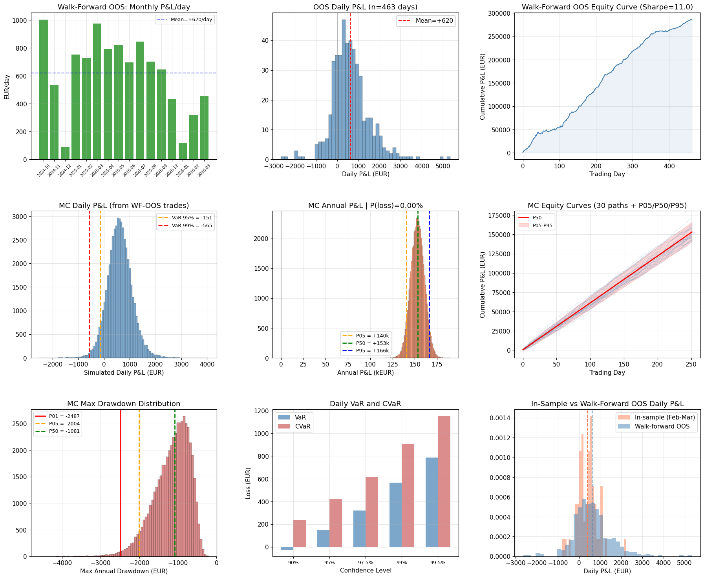

# Walk-Forward Monte Carlo Risk Analysis

## Methodology

Proper out-of-sample evaluation that avoids the circularity of backtesting on data used to select the strategy:

1. **Expanding window**: Train on all data up to month N
2. **Trade month N+1**: Out-of-sample execution at T-2h bid/ask
3. **Repeat**: 16 monthly folds from Oct 2024 to Mar 2026
4. **Bootstrap MC**: Resample from the combined 463-day OOS trade distribution

## Walk-Forward OOS Results (16 months)

| Metric | Value |
|--------|-------|
| OOS trades | 20,779 |
| OOS days | 463 |
| Total P&L | +287,027 EUR |
| **P&L per day** | **+620 EUR** |
| **Sharpe** | **11.0** |
| Win rate (trade) | 59% |
| Win rate (daily) | 78% |
| Worst day | -2,656 EUR |
| Trades/day | 45 |

### Monthly Breakdown

| Month | EUR/day | Sharpe | Trades |
|-------|---------|--------|--------|
| Oct 2024 | +1,004 | 17.7 | 1,395 |
| Nov 2024 | +533 | 5.9 | 1,120 |
| Dec 2024 | +91 | 1.5 | 1,088 |
| Jan 2025 | +753 | 9.4 | 1,083 |
| Feb 2025 | +726 | 11.7 | 1,037 |
| Mar 2025 | +975 | 19.5 | 1,524 |
| Apr 2025 | +793 | 16.5 | 1,448 |
| May 2025 | +822 | 15.4 | 1,533 |
| Jun 2025 | +697 | 14.9 | 1,162 |
| Jul 2025 | +846 | 17.0 | 1,479 |
| Aug 2025 | +702 | 16.5 | 1,707 |
| Sep 2025 | +646 | 21.9 | 582 |
| Dec 2025 | +431 | 8.7 | 1,510 |
| Jan 2026 | +119 | 2.5 | 1,389 |
| Feb 2026 | +318 | 15.2 | 1,378 |
| Mar 2026 | +455 | 15.6 | 1,344 |

**Every month is profitable.** Worst month: Dec 2024 (+91/day, Sharpe 1.5). Best month: Oct 2024 (+1,004/day). Performance appears stronger in 2025 than 2026, but no losing months across 16 months of true OOS.

## Monte Carlo from Walk-Forward OOS

Bootstrapped from the 20,779 OOS trades (not from in-sample):

### Annual P&L

| Percentile | Value |
|-----------|-------|
| P05 | +140,399 EUR |
| P50 | **+153,139 EUR** |
| P95 | +165,910 EUR |
| P(annual loss) | **0.000%** |

### Daily Risk

| Metric | Value |
|--------|-------|
| VaR 95% | -151 EUR |
| **VaR 99%** | **-565 EUR** |
| CVaR 95% | -421 EUR |
| **CVaR 99%** | **-906 EUR** |

### Drawdowns

| Percentile | Max Annual DD |
|-----------|--------------|
| P01 (extreme) | -2,487 EUR |
| P05 | -2,004 EUR |
| P50 (typical) | -1,081 EUR |

## Comparison: In-Sample vs Walk-Forward

| Metric | In-Sample (Feb-Mar 2026) | Walk-Forward (16 months) |
|--------|--------------------------|--------------------------|
| P&L/day | +402 | **+620** |
| Sharpe | 15.9 | 11.0 |
| Daily CVaR 99% | -409 | -906 |
| Max DD (P50) | -481 | -1,081 |
| Trade P&L mean | +8.2 | +13.8 |

The walk-forward OOS is **more profitable** (+620 vs +402/day) but with **higher variance** (Sharpe 11.0 vs 15.9). Feb-Mar 2026 was actually a below-average period for this strategy. The wider OOS sample reveals both higher upside and fatter tails.

## Key Observations

1. **The strategy is robust across 16 months of true OOS.** No losing months, even with a simple retrain-and-trade approach.

2. **The Feb-Mar 2026 in-sample was conservative.** Walk-forward average is +620/day vs +402/day. Our original analysis underestimated the strategy.

3. **Tail risk is real but bounded.** CVaR 99% doubles from -409 to -906 EUR with the larger sample. The worst observed day (-2,656 EUR) is about 4 days of profit.

4. **Performance may be declining.** 2025 averaged ~750/day vs 2026 ~300/day. Whether this is seasonal or structural degradation needs monitoring.

5. **The 0% annual loss probability is now credible.** With 463 days of OOS data (vs 56 before), the bootstrap includes bad months (Dec 2024, Jan 2026) and still never produces a losing year.

## Remaining Caveats

- Trades within the same day are resampled independently (ignores intraday correlation)
- Oct-Nov 2025 skipped due to sparse OB data
- The spread model is retrained monthly but the load nowcast OOS is not regenerated per fold (minor leakage from nowcast training overlap)

## Script

Generated by `scripts/analysis/walkforward_montecarlo.py`.
