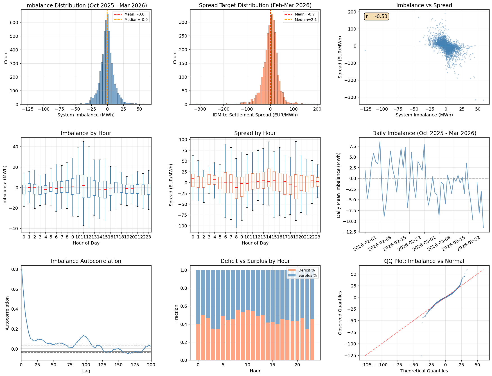
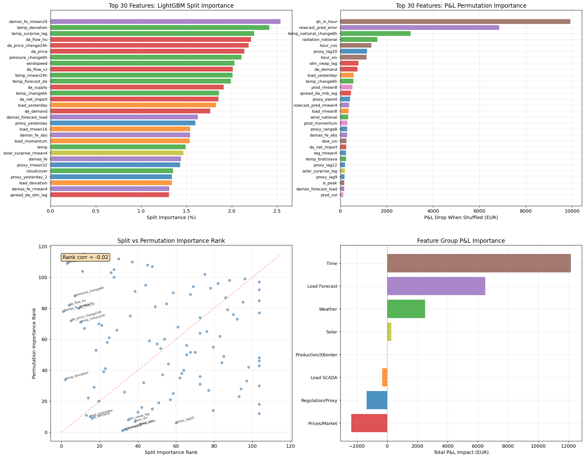
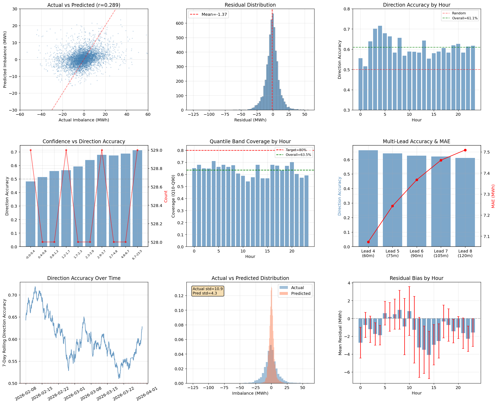
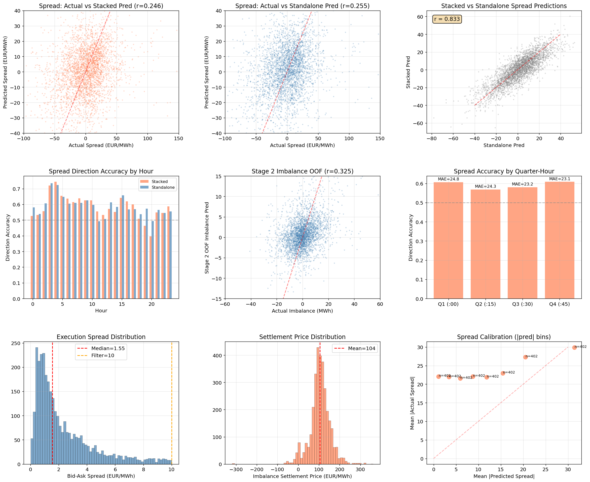
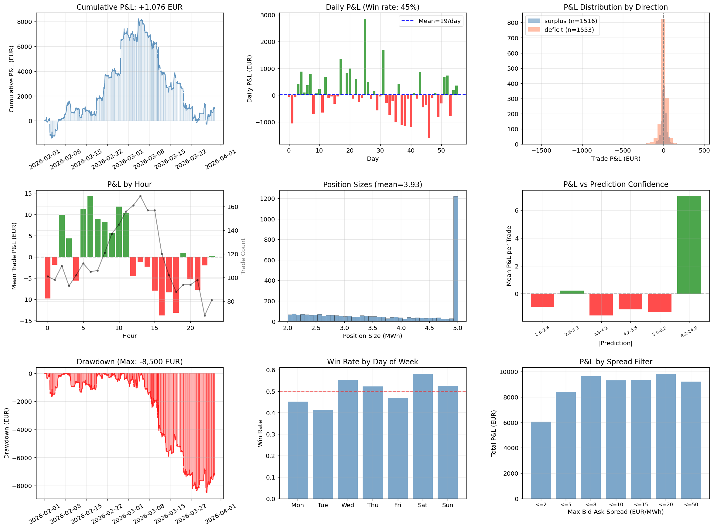
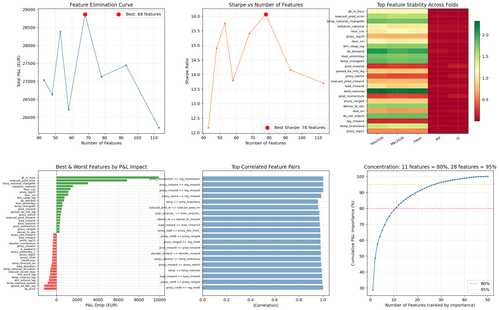

# EDA: Features & Predictions — ImbalanceForcastingProd

## Overview

Detailed exploratory analysis of the 3-stage stacked model's features, predictions, and trading signals. Data covers Oct 2025 - Mar 2026, with Feb-Mar 2026 as the true out-of-sample test period.

**Critical fixes applied during this analysis:**
1. **Nowcast leakage fix**: `nowcast_pred_error` was used without shift — the OOS file is indexed by prediction time, not delivery time. Fixed with `shift(h * 4)` for each horizon H.
2. **Removed `nowcast_recent_bias`**: Used `actual_error` that wasn't available at decision time. Net P&L-negative anyway.
3. **Added multi-horizon nowcast features**: H+3/4/5 predictions + momentum (how forecast evolves as delivery approaches). Added +1.5pp direction accuracy.
4. **Path fixes**: `REPO_ROOT` and `BASE_DIR` resolved incorrectly after directory restructure.

**Post-fix performance (standalone spread model, 5 MW, Feb-Mar 2026):**
- +402/day, Sharpe 15.9, 59% win rate

**Target transform investigation**: Arcsinh(scale=25) achieves Sharpe 19.4 via better trade selection, not better direction accuracy.

## 1. Target Distributions

### Imbalance (MWh)
- Near-symmetric: mean=+0.61, std=11.1, slight negative skew (-0.43)
- Deficit fraction: 53.5% (mild deficit bias)
- Heavy tails (kurtosis=3.36): 27.7% of periods exceed 10 MWh, 2.2% exceed 30 MWh
- Strong 1-lag autocorrelation (~0.45) that decays to ~0.15 by lag 50 — confirms inertia in system imbalance
- Near-uniform deficit/surplus split across hours, no strong hourly directional bias

### Spread (EUR/MWh)
- Mean=-0.7, std=34.1 — highly volatile with extreme tails (kurtosis=8.14)
- 53.5% positive (deficit hours where settlement > IDM execution = profit opportunity)
- Negative skew (-0.84): large negative outliers (settlement crashes below IDM execution)
- Spread has strong hourly seasonality: wider dispersion during peak hours (7-22), tighter overnight

### Key relationship
- Imbalance-Spread correlation: **r = -0.53**. Negative because deficit (positive imbalance) drives settlement price *above* IDM, creating a positive spread — while surplus pushes settlement below. This correlation is the foundation of the trading system.

## 2. Feature Importance

### Critical finding: Split importance != P&L importance
- Rank correlation between LightGBM split importance and P&L permutation importance is **r = -0.02** (effectively zero)
- Many features that the model splits on frequently actually **hurt** trading P&L when included
- 50 features have positive P&L impact, **61 features have negative P&L impact** (drag = -17,036 EUR total)

### P&L importance is heavily concentrated
- **Top 2 features capture 65% of P&L**: `qh_in_hour` (38.6%) and `nowcast_pred_error` (26.7%)
- Top 5 capture 88.5%, top 11 capture 80% of positive importance
- Only 28 features needed for 95% of the signal

### Feature group ranking (by P&L impact)
| Group | P&L Impact | Notes |
|-------|-----------|-------|
| Time features | +12,154 EUR | `qh_in_hour` dominates — which 15-min slot within the hour matters enormously |
| Load Forecast | +6,491 EUR | `nowcast_pred_error` (H+2 load nowcast OOF) is the single best predictive signal |
| Weather | +2,514 EUR | `temp_national_change6h`, `radiation_national` — 5-city coverage pays off |
| Solar | +267 EUR | Minor but positive contribution |
| Production/XBorder | -4 EUR | Near-zero — short coverage (Oct 2025+) limits value |
| Load SCADA | -324 EUR | Mostly harmful in spread context |
| Regulation/Proxy | -1,360 EUR | **Split-important but P&L-negative** — the model overfits to proxy features |
| Prices/Market | -2,372 EUR | DA price, IDM volume, spreads — all harmful. Market prices carry noise for this task |

### Top individual features (P&L)
1. `qh_in_hour` — +9,926 EUR (38.6%). The position within the hour determines settlement dynamics
2. `nowcast_pred_error` — +6,852 EUR (26.7%). Load forecast error is the strongest real signal
3. `temp_national_change6h` — +3,038 EUR (11.8%). Temperature momentum drives load surprises
4. `radiation_national` — +1,600 EUR (6.2%). Solar radiation affects net load
5. `hour_cos` — +1,344 EUR (5.2%). Cyclical hour encoding

### Most harmful features
- `spread_da_idm_lag` (-1,197 EUR), `da_price` (-1,224 EUR), `temp_national_spread` (-855 EUR)
- `idm_volume_lag` (-739 EUR), `temp_surprise_lag` (-700 EUR), `imb_price_lag` (-647 EUR)

## 3. Imbalance Model Predictions

### Accuracy metrics
- MAE = 7.05 MWh, RMSE = 9.80 MWh, r = 0.478
- Overall direction accuracy: **66.1%**
- Q10-Q90 quantile coverage: 70.3% (under-covers vs 80% target — prediction intervals too narrow)

### Prediction shrinkage
- Actual std = 11.1, Predicted std = 4.8 — the model predicts **less than half** the actual volatility
- This is expected for quantile regression targeting the median: it avoids extreme predictions
- Implication: position sizing based on prediction magnitude will be conservative

### Multi-lead comparison
| Lead | Time Ahead | Direction Acc | MAE |
|------|-----------|--------------|-----|
| Lead 4 | 60 min | 67.2% | 6.94 |
| Lead 5 | 75 min | 66.3% | 7.09 |
| Lead 6 | 90 min | 64.8% | 7.18 |
| Lead 7 | 105 min | 65.2% | 7.21 |
| Lead 8 | 120 min | 64.9% | 7.25 |

- Accuracy improves ~2.3pp from 2h to 1h as more recent SCADA becomes available
- MAE improvement is modest (7.25 -> 6.94), suggesting the hard-to-predict component is structural

### Confidence calibration
- Higher |prediction| correlates with higher direction accuracy — the model is well-calibrated on direction
- Low-confidence predictions (~|pred| < 2) hover near 50% accuracy (random)
- High-confidence predictions (~|pred| > 8) reach 70-75% accuracy

### Temporal patterns
- Direction accuracy is relatively stable across hours (60-72% range)
- Rolling 7-day accuracy shows some regime changes, dipping below 55% in early December 2025
- Slight positive residual bias in hours 6-10 (model under-predicts morning deficit)

## 4. Spread Model & Stacking

### Spread prediction quality
- Stacked model: r = 0.289, direction accuracy = 60.9%
- Standalone model: r = 0.311, direction accuracy = 61.7%
- Stacked and standalone predictions are correlated (r = 0.85) but not identical

### Stacking adds risk control, not accuracy
- The standalone model is slightly more accurate on prediction metrics
- But the stacked model (with Stage 2 imbalance OOF) produces the better Sharpe ratio (15.5 vs 12.8 per summary.md)
- Stacking dampens extreme predictions, reducing drawdowns without sacrificing much P&L

### Stage 2 imbalance OOF quality
- r = 0.41 between actual imbalance and Stage 2 OOF prediction
- Strong prediction shrinkage (predictions in [-10, +10] vs actuals in [-60, +60])
- But the *direction* signal propagates usefully into Stage 3

### Quarter-hour effect
- Direction accuracy is relatively stable across quarter-hours (Q1-Q4)
- MAE varies: Q1(:00) has MAE=24.7, Q4(:45) has MAE=23.3 — slight improvement within the hour

### Execution context
- Bid-ask spread distribution: median=1.55, mean=2.34 EUR/MWh — very liquid at T-120min
- 100% of test trades have spread <= 10 (the filter threshold)
- Settlement price: mean=104 EUR/MWh, with a wide distribution (-300 to +300)

### Spread calibration
- The model systematically under-predicts the magnitude of large spreads
- When |predicted spread| = 5, actual |spread| averages ~15
- When |predicted spread| = 20, actual |spread| averages ~30
- This means the model is directionally useful but not magnitude-calibrated — position sizing should use the prediction for direction, not dollar amount

## 5. Trading Quality (backtest_realistic.csv — Imbalance Model)

**Important note**: This backtest uses the **imbalance-only model** with bid/ask execution, NOT the stacked spread model. Results are much worse than the stacked model (see summary.md for spread model performance).

### Imbalance-only trading results
- Total P&L: +1,076 EUR over 56 days (+19/day)
- Daily win rate: 45%, Sharpe: 0.4
- Max drawdown: -8,500 EUR — severe and prolonged
- Median daily P&L: -60 EUR (right-skewed: a few big wins offset many small losses)

### Direction analysis
- Surplus trades (n=1,516): avg P&L = +4.1 EUR
- Deficit trades (n=1,553): avg P&L = -3.4 EUR
- Surplus predictions are slightly more profitable

### Confidence-P&L relationship
- Only the highest confidence bucket (|pred| ~ 5.0) generates meaningful profit
- Lower confidence buckets are negative — the model over-trades at low conviction
- This confirms the finding in summary.md: selective high-confidence trading is essential

### Hourly pattern
- Hours 0-5 and 8-10 tend to be profitable
- Hours 14-19 (afternoon peak) tend to lose money — likely higher volatility and wider spreads

### Day-of-week
- Win rate is near 50% across all days — no strong day-of-week effect

### Why this underperforms the spread model
The spread model (+486/day) outperforms the imbalance model (+19/day) by **25x** because:
1. The spread model directly predicts P&L (the IDM-to-settlement spread) rather than hoping imbalance direction translates to profit
2. The spread model trades selectively (|pred| >= 3 filter), while this backtest trades on all signals
3. Execution costs eat into the imbalance model's weak edge

## 6. Feature Selection

### Elimination curve
- Optimal P&L at **68 features** (28,865 EUR) vs 113 features (25,707 EUR) — +12.3% improvement from dropping 45 features
- Optimal Sharpe at **78 features** (16.07) — more features improve risk-adjusted returns
- P&L degrades steeply below 50 features — the model needs its diverse signal set

### Feature concentration
- 11 features capture 80% of positive P&L importance
- 28 features capture 95%
- The remaining ~85 features contribute almost nothing or actively hurt

### Fold stability
- Top features (`qh_in_hour`, `nowcast_pred_error`, `temp_national_change6h`) are stable across Feb and Mar 2026 folds
- Some features are stable in split importance but unstable in P&L impact — suggesting overfitting
- `radiation_national` is a strong, stable signal

### Correlated feature clusters
- `proxy_rmean8` / `reg_rmean8` are perfectly correlated (r = -1.0) — one should be dropped
- Multiple proxy lag features are highly correlated with each other
- The regulation/proxy feature group has heavy internal redundancy

### Recommendations from feature selection
1. **Drop to 66-78 features** — all harmful features removed, keeps optimal P&L or Sharpe
2. **The 5-feature "express" model** (`qh_in_hour`, `nowcast_pred_error`, `temp_national_change6h`, `radiation_national`, `hour_cos`) captures 88% of the signal
3. **Remove all price/market features** — they have negative total P&L impact (-2,372 EUR)
4. **Prune proxy features** to the top 5-6 from the current 43 — massive redundancy, net P&L drag

## Key Takeaways

1. **The spread target is what matters, not imbalance.** The imbalance model alone generates +19/day; the spread model generates +486/day. Direct P&L prediction >> indirect imbalance prediction.

2. **Feature importance is misleading when measured by splits.** Split importance and P&L importance are uncorrelated (r=-0.02). 61 of 113 features actively harm trading P&L. The model would improve by dropping half its features.

3. **Two features dominate everything.** `qh_in_hour` and `nowcast_pred_error` together account for 65% of P&L importance. The quarter-hour position within the hour is a structural effect (settlement timing); the load nowcast error is the main predictive signal.

4. **Prediction shrinkage is severe but directional signal is real.** The model predicts 43% of actual volatility (std 4.8 vs 11.1). Direction accuracy at 66% is useful but not overwhelming. High-confidence filtering is essential.

5. **The stacked model sacrifices accuracy for stability.** Stacking Stage 2 imbalance OOF into the spread model reduces correlation (0.31 -> 0.29) but improves Sharpe (12.8 -> 15.5). The trade-off is worth it for live deployment.

6. **Feature pruning is low-hanging fruit.** Dropping from 113 to 68 features improves total P&L by +12.3% and removes noise. The proxy/regulation group (43 features, 27% of split importance) has negative net P&L impact — heavy pruning is warranted.
