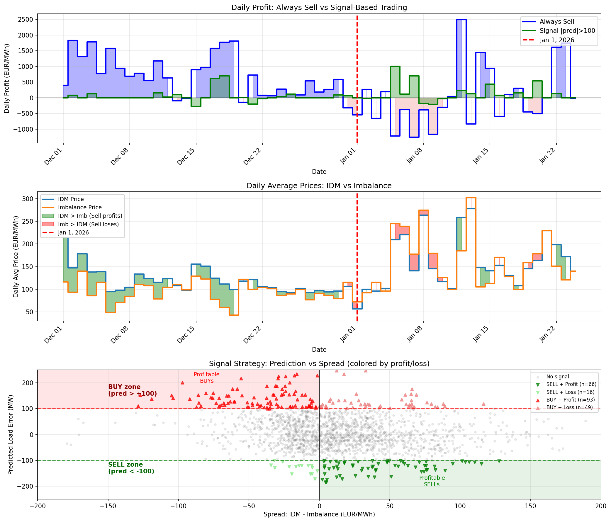

# Strategy Comparison

Final visualization comparing Always Sell vs Signal-Based trading.

## Visualization

### Panel 1: Daily Profit
- Blue: Always Sell daily profit
- Green: Signal-based daily profit
- Shows Always Sell going negative after Jan 1, while Signal stays positive

### Panel 2: Daily Prices (IDM vs Imbalance)
- Step graph showing daily average prices
- Green fill: IDM > Imbalance (sell profits)
- Red fill: Imbalance > IDM (sell loses)
- Clear regime change visible at Jan 1

### Panel 3: Signal Strategy Logic
- Scatter plot: Prediction vs Spread
- SELL zone (pred < -100): Profit when spread > 0
- BUY zone (pred > +100): Profit when spread < 0
- Shows signal correctly identifies profitable trades

## Files

| File | Description |
|------|-------------|
| `plot_strategy_comparison_v5.py` | Final visualization script |
| `16_strategy_comparison_v5.png` | Final comparison chart |

## Key Insight

The signal became essential after Jan 1, 2026 when the pure arbitrage closed. It identifies which direction to trade based on predicted load surprise.
