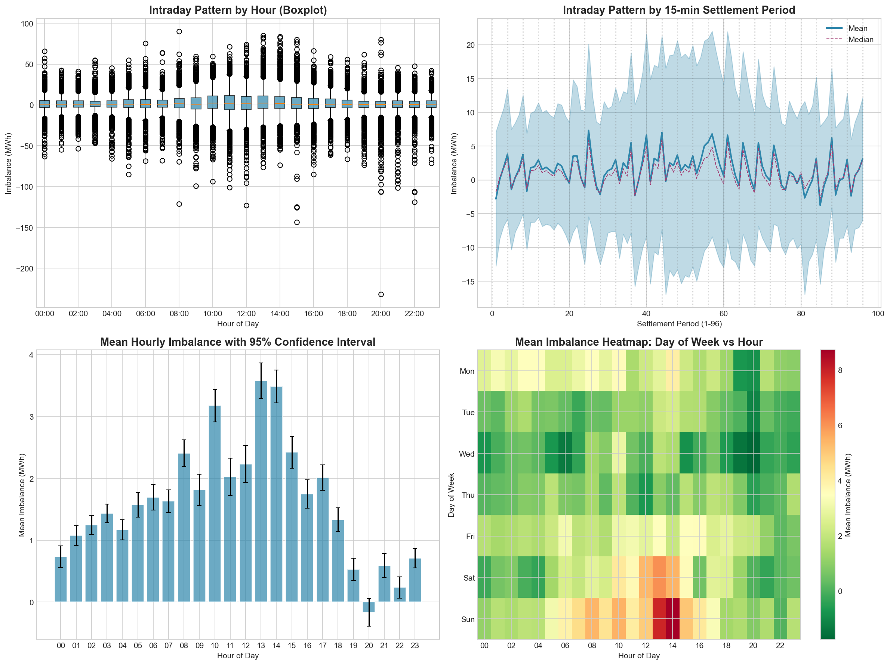
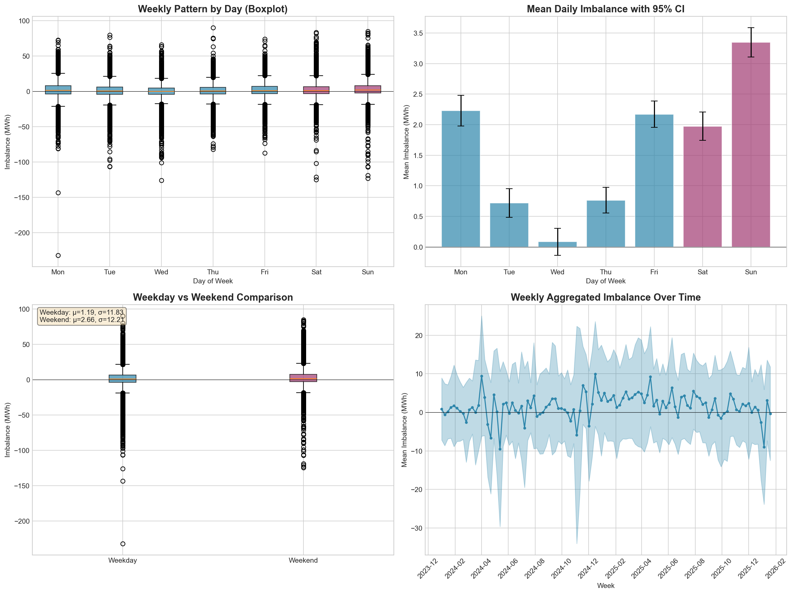
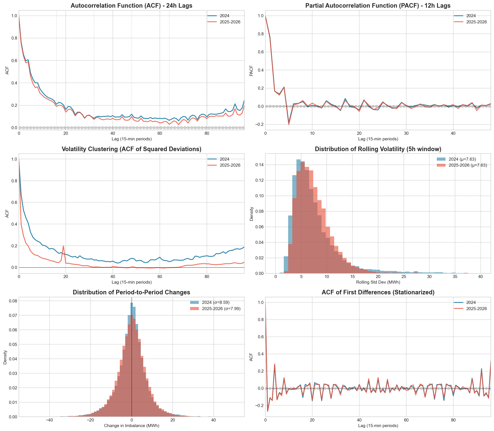
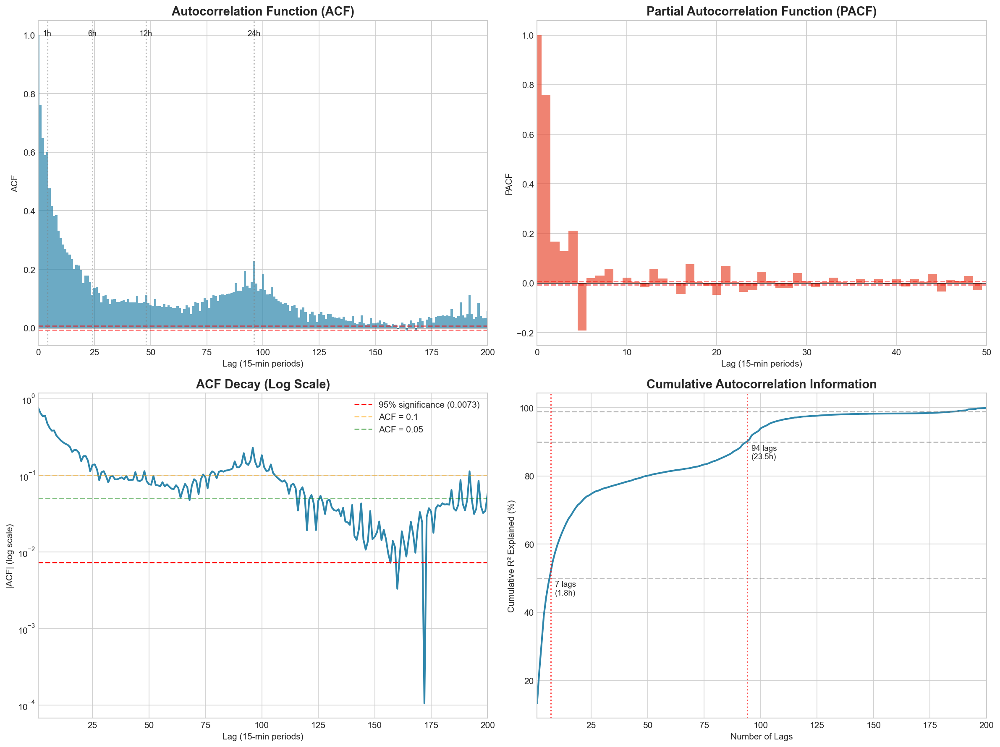

# Data Exploration Findings

## 1. Target Variable Analysis (System Imbalance)

### 1.1 Basic Statistics

| Metric | Value |
|--------|-------|
| Observations | 72,375 |
| Date Range | 2024-01-01 to 2026-01-24 |
| Mean | +1.61 MWh |
| Std Dev | 11.96 MWh |
| Min / Max | -232 / +90 MWh |
| Sign Distribution | 55.5% positive, 44.5% negative |

**Interpretation**: The system tends toward slight over-generation (surplus), but both directions are common. The distribution is roughly symmetric with slight left skew.

### 1.2 Temporal Patterns

#### Daily (Intraday) Pattern
- **Peak**: 13:00-14:00 (mean ~3.5 MWh surplus)
- **Trough**: 20:00 (mean ~-0.2 MWh, near balance)
- **Most volatile**: 11:00-12:00 (std ~16.5 MWh)

**Implication**: Hour-of-day is a predictive feature.

#### Weekly Pattern
- **Highest**: Sunday (mean +3.35 MWh)
- **Lowest**: Wednesday (mean +0.08 MWh)
- **Weekend effect**: +1.46 MWh higher on average

**Implication**: Day-of-week and weekend indicator are useful features.

### 1.3 Year-over-Year Comparison

**Critical Question**: Can we use 2024 data to train a model for 2025-2026?

| Metric | 2024 | 2025-2026 | Difference |
|--------|------|-----------|------------|
| Mean | +0.95 MWh | +2.24 MWh | +1.29 MWh |
| Std Dev | 12.50 MWh | 11.39 MWh | -1.11 MWh |
| ACF Correlation | - | 0.998 | Nearly identical |
| PACF Correlation | - | 0.998 | Nearly identical |

**Conclusion**: The microstructure (autocorrelation, volatility clustering) is identical between periods. The mean shifted slightly, but this is handled by rolling features. **Safe to use all data for training.**

### 1.4 Time Series Decomposition

Using MSTL (Multiple Seasonal-Trend decomposition):

| Component | Variance Explained |
|-----------|-------------------|
| Trend | 6.2% |
| Daily Seasonal | 19.6% |
| Weekly Seasonal | 8.3% |
| **Residual** | **56.8%** |

**Interpretation**:
- ~43% of variance is "easy" - captured by simple time features
- ~57% is "hard" - requires ML to learn from regulation and other signals

### 1.5 Advanced Statistical Properties

| Property | Finding | Model Implication |
|----------|---------|-------------------|
| **Autocorrelation** | Lag 1 = 0.76, decays to 0.60 at lag 4 | Use lag features |
| **Sign Persistence** | 78% probability same sign continues | Previous sign is predictive |
| **ARCH Effects** | Strong volatility clustering | Rolling std is valuable |
| **Stationarity** | Series is stationary | No differencing needed |
| **Extreme Events** | Cluster in runs of ~2.5 periods | Momentum during extremes |

---

## 2. Feature Data Analysis

### 2.1 Available Features

| Feature | Update Freq | Coverage | Description |
|---------|-------------|----------|-------------|
| Regulation (MW) | 3-min | Full | Real-time balancing signal |
| Load (MW) | 3-min | Full | System demand |
| Production (MW) | 3-min | Oct 2025+ only | System generation |
| Export/Import (MW) | 3-min | Oct 2025+ only | Cross-border flows |

### 2.2 Feature-Label Correlations

| Feature | Correlation | R² | Status |
|---------|-------------|-----|--------|
| Regulation | -0.667 | 44.5% | **PRIMARY** |
| Regulation Deviation | -0.672 | 45.2% | **PRIMARY** |
| Load Deviation | -0.116 | 1.3% | Useful |
| Load Raw | -0.101 | 1.0% | Less useful |
| Production | -0.050 | 0.25% | **ABANDONED** |
| Export/Import | +0.024 | 0.06% | **ABANDONED** |

**Key Finding**: Regulation alone explains ~45% of imbalance variance. Production and export/import have negligible correlation - we can drop them.

### 2.3 Within Quarter-Hour Dynamics

Each 15-minute settlement period has 5 regulation observations (at minutes 0, 3, 6, 9, 12).

| Minute | Cumulative Mean Correlation | R² |
|--------|-----------------------------|----|
| 0 | -0.685 | 47% |
| 3 | -0.708 | 50% |
| 6 | -0.782 | 61% |
| 9 | -0.849 | 72% |
| 12 | -0.889 | 79% |

**Key Finding**: Even at minute 0, we can predict 47% of variance. Cumulative mean is the best feature.

### 2.4 Conditional Analysis

When does the regulation-imbalance relationship vary?

| Condition | Stable? | Notes |
|-----------|---------|-------|
| Weekday/Weekend | YES | No significant difference |
| Load Level | YES | Equal across load quartiles |
| Hour of Day | **NO** | Best 11-14h (r=-0.77), worst 21-23h (r=-0.46) |
| Imbalance Magnitude | **NO** | Large imbalances well predicted (r=-0.78), small poorly predicted (r=-0.13) |

**Implication**: Hour-of-day should be a feature; model will perform better during midday.

### 2.5 Lag Feature Analysis

| Feature Addition | R² Improvement |
|------------------|----------------|
| Regulation only | 47.4% (baseline) |
| + Lag 1 regulation | +2.4% |
| + Residual lag 1 | +2.5% |
| + Load deviation | +0.3% |

**Key Finding**: Previous period's regulation/residual adds ~2.5% R². Diminishing returns beyond lag 2-4.

---

## 3. Summary: What We Learned

### Data Quality
- 1 outlier removed (-1732 MWh on 2025-12-01)
- No structural breaks between years
- Series is stationary (no differencing needed)

### Predictable Structure
- 43% from time patterns (daily + weekly)
- Additional ~10% from lag features
- Remaining ~47% is irreducible noise

### Key Predictors
1. **Regulation** - primary signal (r = -0.67)
2. **Previous period proxy** - captures autocorrelation
3. **Hour of day** - correlation varies by hour
4. **Load deviation** - small independent signal

### Abandoned Features
- **Production/Export data** - near-zero correlation
- **Month feature** - risk of overfitting
- **Raw load** - deviation is better

---

*See Section 2 for feature engineering decisions based on these findings.*
