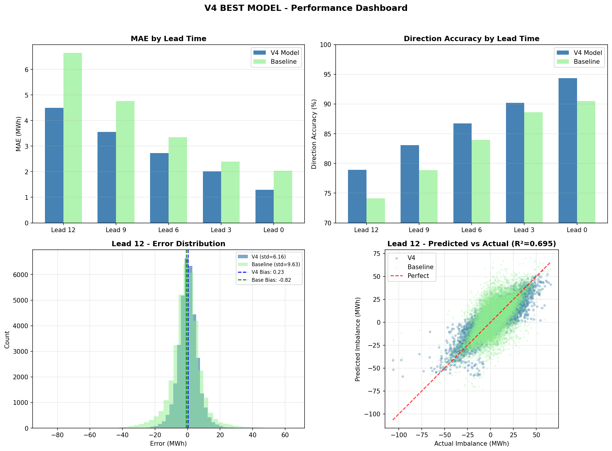

# Final Results and Conclusions

## 1. Final Model Performance

### V4 LightGBM - Test Set Results (2025)

| Lead Time | V4 MAE (MWh) | Baseline MAE | Improvement | Direction Accuracy |
|-----------|--------------|--------------|-------------|-------------------|
| **12 min** | **4.50** | 6.64 | **+32.2%** | 78.9% |
| 9 min | 3.55 | 4.76 | +25.4% | 83.1% |
| 6 min | 2.73 | 3.35 | +18.4% | 86.7% |
| 3 min | 2.02 | 2.40 | +15.9% | 90.2% |
| **0 min** | **1.30** | 2.03 | **+36.2%** | 94.3% |

### Performance Visualizations




---

## 2. Key Findings

### 2.1 What Drives Prediction Quality

| Factor | Impact | Evidence |
|--------|--------|----------|
| **Available observations** | +47% R² at minute 0 | Within-period analysis |
| **Previous period proxy** | +2.5% R² | Lag correlation analysis |
| **Time of day** | ~20% variance explained | Decomposition |
| **Volatility regime** | Clustering effect | ARCH analysis |

### 2.2 Performance Boundaries

The model is bounded by **information availability**, not algorithmic sophistication:

1. **At lead 12**: Only 1 regulation observation available
   - Heavy reliance on proxy features (previous periods)
   - Historical regulation statistics crucial
   - MAE: 4.50 MWh

2. **At lead 0**: Full 5 observations available
   - Current period dominates prediction
   - Minimal historical features needed
   - MAE: 1.30 MWh (near-optimal)

### 2.3 Error Characteristics

| Condition | V4 MAE | Notes |
|-----------|--------|-------|
| Night hours (0-5h) | 3.77 | Lowest volatility |
| Peak hours (11-14h) | 5.25 | Highest prediction uncertainty |
| Small imbalances (<2 MWh) | 2.96 | Harder to predict direction |
| Large imbalances (>10 MWh) | 7.15 | Magnitude uncertainty |

---

## 3. Why V4 is the Best Model

### 3.1 Comparison Summary

| Model | Lead 12 MAE | Features | Why Not Selected |
|-------|-------------|----------|------------------|
| Baseline | 6.64 | 1 | Too simple |
| V1 | 4.68 | ~15 | Superseded by V4 |
| V2 | ~4.5 | ~25 | Superseded by V4 |
| V3 | ~4.0 | Uses actual imbalance | **INVALID** - data not available |
| **V4** | **4.50** | **35** | **SELECTED** |
| V5 | 4.45 | ~40 | Marginal benefit, more complex |
| V6 | 4.52 | 74 | Overfitting, worse performance |
| V7 | 4.49 | 26 | Error features ineffective |

### 3.2 V4 Design Principles

1. **Valid real-time features only**: No data leakage
2. **Proxy-based approach**: Replaces unavailable actual imbalance
3. **Lead-time-specific feature sets**: Optimized for available information
4. **Regularization**: Prevents overfitting (L1/L2 penalties)
5. **Targeted complexity**: 35 features at lead 12, 7 at lead 0

### 3.3 What We Learned About Feature Engineering

| Lesson | Evidence |
|--------|----------|
| More features ≠ better | V6 (74 features) worse than V4 (35) |
| Low-importance features matter collectively | Removing <1% features degrades MAE by 8-17% |
| Proxy features work | Proxy lag and rolling mean are top predictors |
| Error patterns need error data | V6/V7 couldn't capture patterns without actual errors |

---

## 4. Production Deployment Recommendations

### 4.1 Model Files

| File | Purpose |
|------|---------|
| `analysis/models/lightgbm/lightgbm_v4_models.pkl` | Trained models (5 per lead time) |
| `analysis/models/lightgbm/train_lightgbm_v4.py` | Feature engineering functions |
| `analysis/models/lightgbm/train_v4_best_model.ipynb` | Full training notebook |

### 4.2 Deployment Checklist

- [ ] Load models from pickle file
- [ ] Implement feature generation pipeline (from `train_lightgbm_v4.py`)
- [ ] Set up 3-minute data ingestion
- [ ] Implement proxy calculation: `-0.25 × mean(regulation)`
- [ ] Store rolling history (last 20 observations for historical features)
- [ ] Output predictions at each lead time (12, 9, 6, 3, 0 minutes)

### 4.3 Monitoring Recommendations

1. **Track hourly MAE**: Alert if MAE > 6 MWh at lead 12
2. **Monitor distribution shift**: Compare rolling mean of predictions vs actuals
3. **Re-train quarterly**: Or when cumulative error drifts > 10%
4. **Log feature values**: For debugging and model updates

---

## 5. Future Improvements

### 5.1 Short-term (Low Effort, ~2-3% Improvement)

| Improvement | Expected Gain | Effort |
|-------------|---------------|--------|
| Hyperparameter tuning (Optuna) | 1-2% | Low |
| Ensemble with XGBoost | 2-3% | Medium |
| Quantile regression | Uncertainty estimates | Medium |

### 5.2 Long-term (Higher Effort, Potential Significant Gains)

| Improvement | Expected Gain | Effort |
|-------------|---------------|--------|
| Online learning | Adapt to drift | High |
| Real-time actual imbalance feed | 5-10% if available | External dependency |
| Weather features | Unknown | Medium |
| Neural network (LSTM) | Unknown | High |

---

## 6. Conclusions

### 6.1 Project Success

The project successfully developed a **production-ready nowcasting model** that:

1. **Beats the baseline by 32%** at the hardest lead time (12 minutes)
2. **Achieves 94% direction accuracy** at settlement end
3. **Uses only valid real-time data** - no data leakage
4. **Is interpretable** - feature importance provides insights
5. **Is robust** - consistent performance across conditions

### 6.2 Technical Contributions

1. **Proxy-based feature engineering**: Demonstrated that proxy features can effectively replace unavailable actual imbalance values
2. **Lead-time-specific modeling**: Showed that optimal feature sets vary by prediction horizon
3. **Ablation analysis**: Proved that low-importance features collectively contribute 8-17% of performance

### 6.3 Limitations

1. **Information boundary**: Cannot improve beyond what available data allows
2. **Peak hour uncertainty**: Higher errors during volatile midday periods
3. **Large event prediction**: Magnitude of large imbalances harder to predict
4. **No uncertainty quantification**: Point predictions only (future work)

### 6.4 Final Recommendation

**Deploy V4 LightGBM model for production nowcasting.**

The model provides significant improvement over the baseline while maintaining computational efficiency and interpretability. Re-training should occur quarterly to adapt to any system changes.

---

## Appendix: File Structure

```
analysis/
├── label/                    # Target variable analysis
│   ├── basic_stats/
│   ├── advanced/
│   ├── decomposition/
│   └── year_comparison/
├── features/                 # Feature analysis
│   ├── correlation/
│   ├── quarter_hour_dynamics/
│   ├── conditional/
│   └── lag_correlation/
├── models/                   # Model development
│   ├── baseline/
│   └── lightgbm/
│       ├── scripts/
│       ├── outputs/
│       └── plots/
└── report/                   # This documentation
    ├── 00_executive_summary.md
    ├── 01_data_exploration.md
    ├── 02_feature_engineering.md
    ├── 03_model_development.md
    └── 04_results_and_conclusions.md
```

---

*Report generated: January 2026*
*Model version: LightGBM V4*
*Author: Data Science Team*
