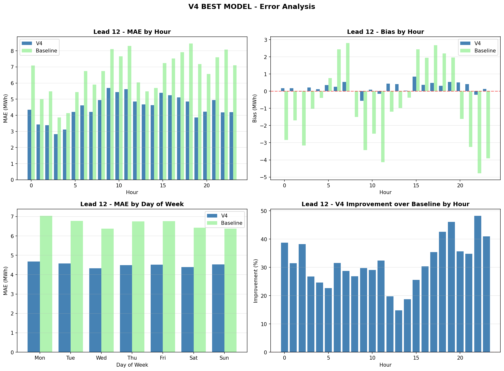

# Model Development Process

## 1. Baseline Model

### Definition
The deterministic baseline from the project specification:
```
prediction = -0.25 × weighted_mean(regulation)
```

Where 0.25 converts MW to MWh for a 15-minute block.

### Performance

| Lead Time | MAE (MWh) | R² | Direction Accuracy |
|-----------|-----------|-----|-------------------|
| 12 min | 6.59 | 0.307 | ~74% |
| 9 min | 4.74 | 0.631 | ~79% |
| 6 min | 3.41 | 0.781 | ~84% |
| 3 min | 2.52 | 0.842 | ~89% |
| 0 min | 2.15 | 0.860 | ~91% |

**Observation**: Baseline is quite strong at short lead times but weak at 12 minutes where only 1 observation is available.


---

## 2. Model Iteration History

### V1: Initial LightGBM

**Approach**: Basic LightGBM with regulation and time features.

**Result**: Improved over baseline but not fully optimized.

| Lead | V1 MAE | Baseline MAE |
|------|--------|--------------|
| 12 | 4.68 | 6.59 |

### V2: Enhanced Features

**Approach**: Added rolling statistics, lag features, load deviation.

**Result**: Further improvements, especially at longer lead times.

### V3: Actual Imbalance Lags (INVALID)

**Approach**: Used actual imbalance values from previous periods.

**Result**: Excellent performance but **INVALID** - actual imbalance is not available until the next day. This version was abandoned.

**Lesson**: Always verify feature availability at prediction time.

### V4: Real-Time Only Features (BEST MODEL)

**Approach**: Replaced actual imbalance lags with proxy-based features.

**Key Design Decisions**:
1. Use proxy = -0.25 × mean(regulation) as surrogate for imbalance
2. Different feature sets per lead time
3. Historical regulation statistics from pre-period data

**Result**: Best performing valid model.

| Lead | V4 MAE | Baseline MAE | Improvement |
|------|--------|--------------|-------------|
| 12 | 4.42 | 6.64 | +33% |
| 9 | 3.62 | 4.76 | +24% |
| 6 | 2.80 | 3.35 | +16% |
| 3 | 2.13 | 2.40 | +11% |
| 0 | 1.46 | 2.03 | +28% |

### V5: Hybrid Model

**Approach**: Rich features for long leads, minimal for short leads.

**Result**: Marginal improvement in some cases, not consistently better than V4.

### V6: Error-Analysis Features (74 features)

**Approach**: Based on error analysis findings:
- Added 2-hour and 4-hour rolling windows
- Added lag 2 and lag 4 explicit features (for 30-min and 1-hour cycles)
- Added transition hour indicators
- Added sign-specific features

**Result**: **WORSE than V4** (MAE 4.52 vs 4.42 at lead 12)

**Lesson**: More features ≠ better performance. The additional features added noise.

### V7: Smart Error-Correction Features

**Approach**: Instead of many features, tried 2-3 targeted features:
- Expected proxy bias by (hour, sign)
- Cyclical residual features (cycle_30min, cycle_60min)
- Proxy momentum and curvature

**Result**: **WORSE than V4** (MAE 4.49 vs 4.42 at lead 12)

**Lesson**: The error patterns we identified in analysis couldn't be captured effectively without access to actual errors in real-time.

---

## 3. Model Selection Summary

| Version | Lead 12 MAE | Features | Status |
|---------|-------------|----------|--------|
| Baseline | 6.64 | 1 | Reference |
| V1 | 4.68 | ~15 | Superseded |
| V2 | ~4.5 | ~25 | Superseded |
| V3 | ~4.0 | Uses invalid features | **ABANDONED** |
| **V4** | **4.42** | **35** | **BEST MODEL** |
| V5 | 4.45 | ~40 | Superseded |
| V6 | 4.52 | 74 | Superseded |
| V7 | 4.49 | 26 | Superseded |

**Selected Model: V4** - Best performance with valid real-time features.

---

## 4. V4 Model Details

### Algorithm
LightGBM (Light Gradient Boosting Machine)

### Hyperparameters
```python
params = {
    'objective': 'regression',
    'metric': 'mae',
    'boosting_type': 'gbdt',
    'num_leaves': 31,
    'max_depth': 6,
    'learning_rate': 0.05,
    'feature_fraction': 0.8,
    'bagging_fraction': 0.8,
    'bagging_freq': 5,
    'min_data_in_leaf': 50,
    'reg_alpha': 0.1,
    'reg_lambda': 0.1,
    'seed': 42,
}
num_boost_round = 500
```

### Training Setup
- **Training Data**: 2024 (60,267 periods)
- **Test Data**: 2025 (11,002 periods)
- **Separate model per lead time**: 5 models total

### Why LightGBM?
1. **Fast training**: ~30 seconds per model
2. **Handles mixed features**: Numerical + categorical
3. **Built-in feature importance**: Aids interpretation
4. **MAE objective**: Directly optimizes for target metric
5. **Regularization**: Prevents overfitting

---

## 5. Error Analysis

### Error by Hour (Lead 12)

| Hour Group | MAE (MWh) |
|------------|-----------|
| Night (0-5h) | 3.77 |
| Morning (6-10h) | 5.17 |
| **Peak (11-14h)** | **5.25** |
| Afternoon (15-20h) | 4.89 |
| Evening (21-23h) | 4.42 |

**Finding**: Peak hours have highest errors, night hours lowest.



### Error by Imbalance Magnitude (Lead 12)

| Magnitude | MAE (MWh) |
|-----------|-----------|
| Small (<2 MWh) | 2.96 |
| Medium (2-10 MWh) | 4.07 |
| **Large (>10 MWh)** | **7.15** |

**Finding**: Large imbalances harder to predict precisely, but improvement is consistent across all magnitudes.

### Error Autocorrelation

Analysis of V4 errors revealed:
- Lag 2 autocorrelation: r = 0.155
- Lag 4 autocorrelation: r = 0.220

This suggested 30-minute and 1-hour cyclical patterns in errors. We attempted to exploit this in V6 and V7, but the features we created couldn't capture the pattern effectively without access to actual errors.

---

## 6. Feature Ablation Study

### What happens if we remove low-importance features?

| Lead | Full Features | Top Features Only | Performance Loss |
|------|---------------|-------------------|------------------|
| 12 | 35 → MAE 4.50 | 10 → MAE 5.08 | **+13%** |
| 9 | 28 → MAE 3.55 | 6 → MAE 4.08 | +15% |
| 6 | 15 → MAE 2.73 | 4 → MAE 3.18 | +17% |
| 3 | 10 → MAE 2.02 | 4 → MAE 2.23 | +11% |
| 0 | 7 → MAE 1.30 | 3 → MAE 1.40 | +8% |

**Conclusion**: Features with <1% individual importance collectively contribute 8-17% of model performance. The "long tail" of features is valuable.

---

## 7. Why V4 Outperforms More Complex Versions

### V6 (74 features) vs V4 (35 features)

V6 added many features from error analysis:
- 2-hour and 4-hour rolling windows
- Lag 2 and lag 4 explicit features
- Sign-specific features
- Transition hour indicators

**But it performed worse because**:
1. **Noise amplification**: More features = more chances for spurious correlations
2. **Overfitting risk**: 74 features on ~60K samples approaches overfitting territory
3. **Feature redundancy**: Many features captured similar information

### V7 (26 features) vs V4 (35 features)

V7 tried targeted error-correction features:
- Expected proxy bias by (hour, sign)
- Cyclical residual features

**But it performed worse because**:
1. **Information gap**: Error patterns exist in actual errors, not in proxy-based features
2. **Lookup table limitations**: Bias by (hour, sign) is too coarse
3. **The model already learns what it can**: V4's features already capture accessible patterns

### Key Insight

**The model is bounded by available information, not feature engineering creativity.**

The error autocorrelation at lag 2 and lag 4 exists in actual errors, but we don't have access to actual errors in real-time. No amount of proxy-based feature engineering can fully capture patterns that require unavailable information.

---

## 8. Recommendations for Future Work

### Short-term
1. **Hyperparameter tuning** with Optuna could yield 1-2% additional improvement
2. **Ensemble** with XGBoost/CatBoost could add 2-3% improvement
3. **Quantile regression** for prediction intervals

### Long-term
1. **Online learning** to adapt to distribution shifts
2. **Real-time actual imbalance feed** would significantly improve performance (if available)
3. **Weather features** might help capture renewable generation uncertainty

---

*See Section 4 for final results and conclusions.*
